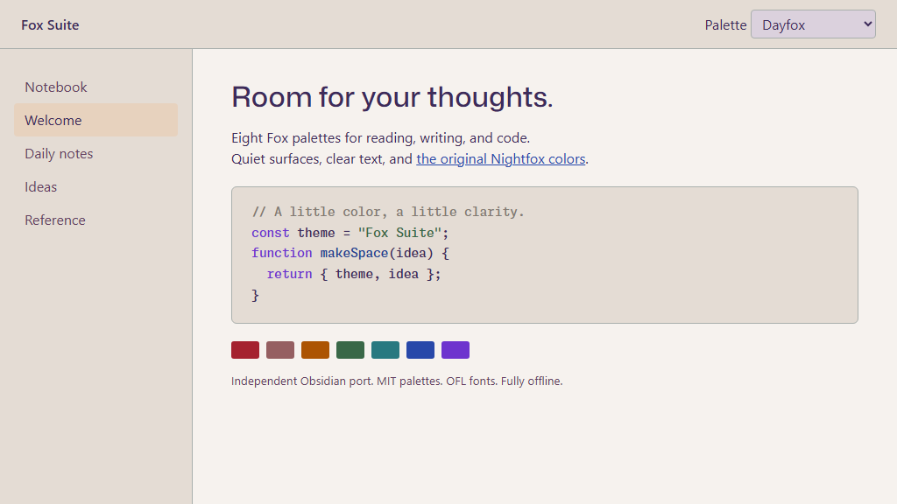
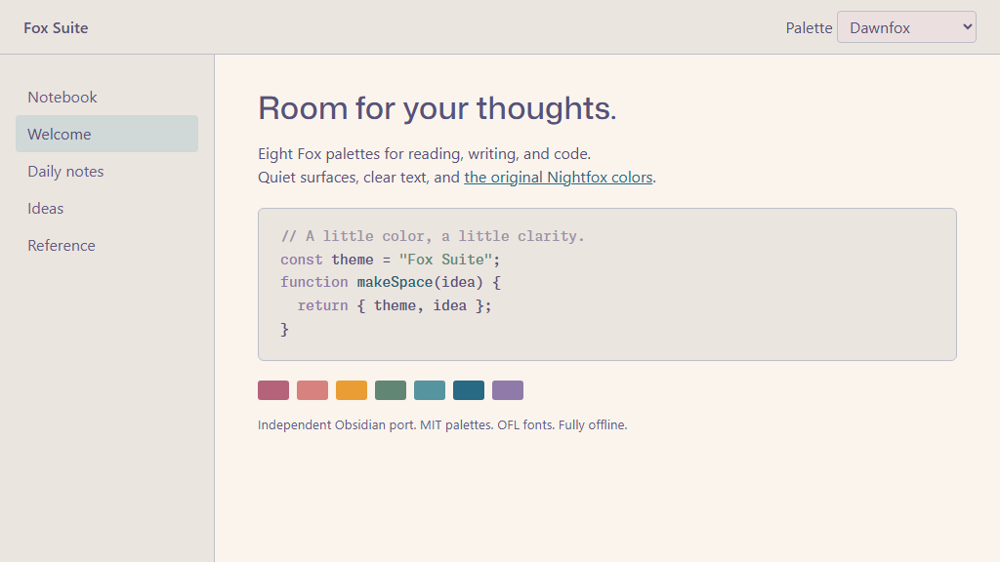
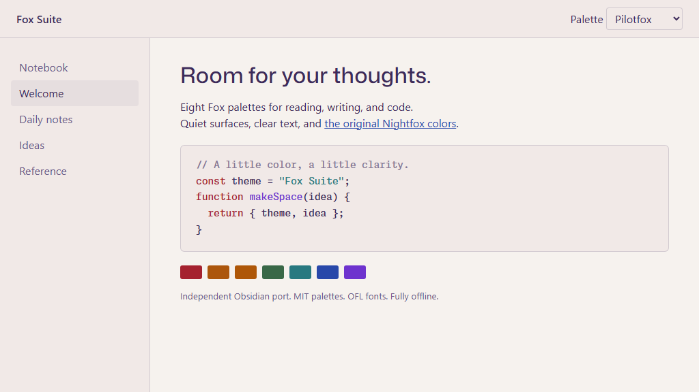
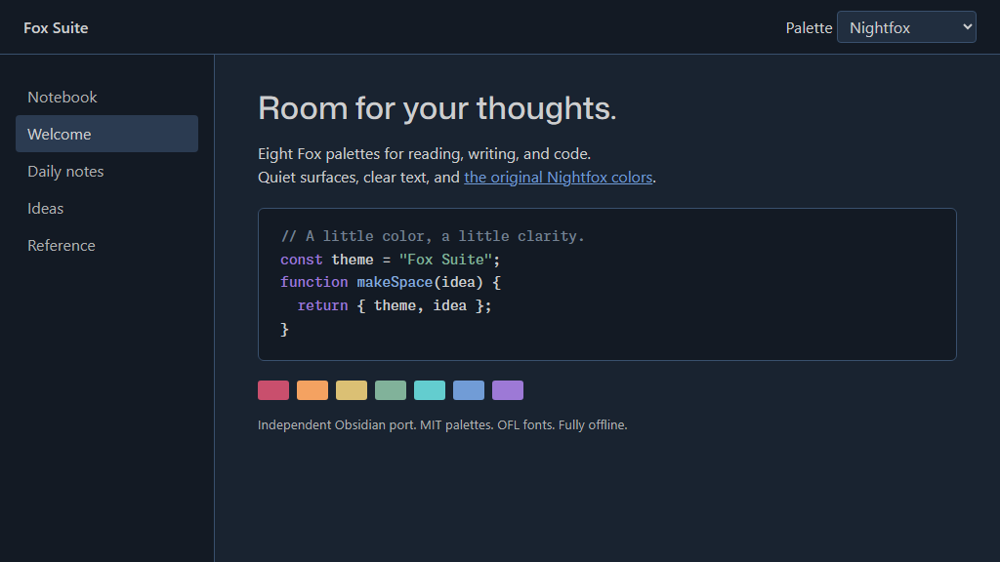
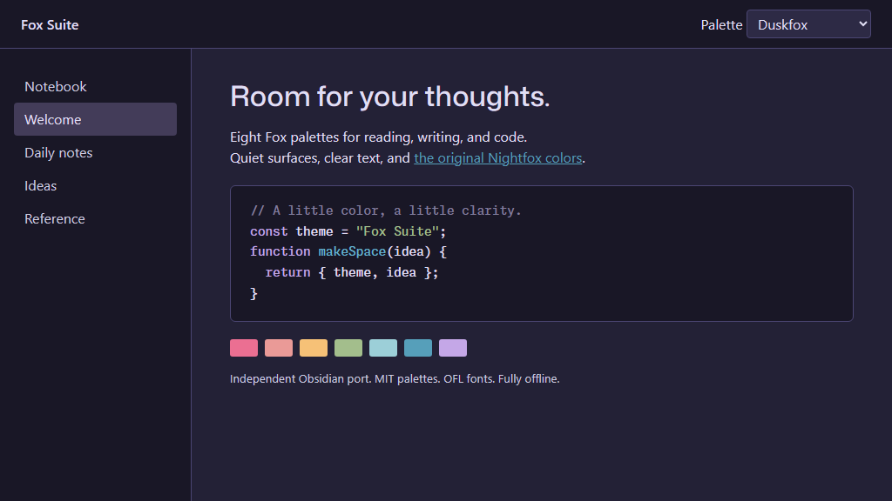
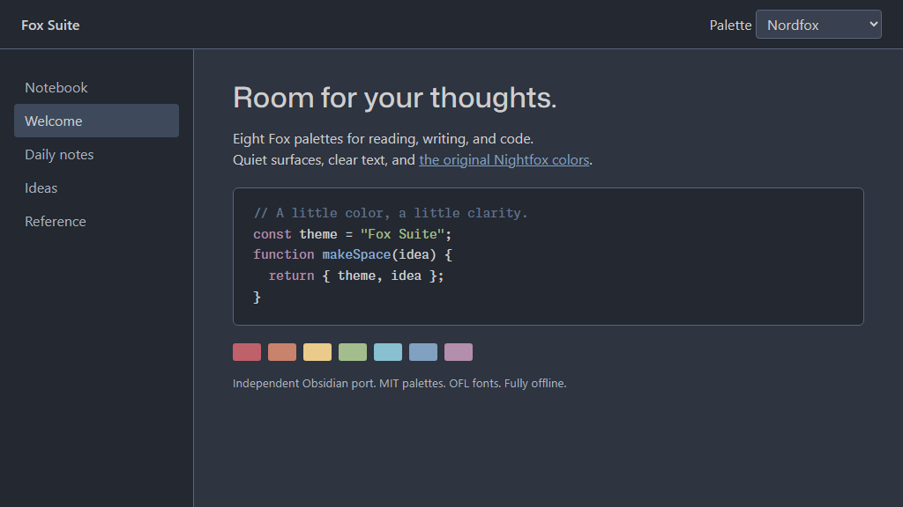
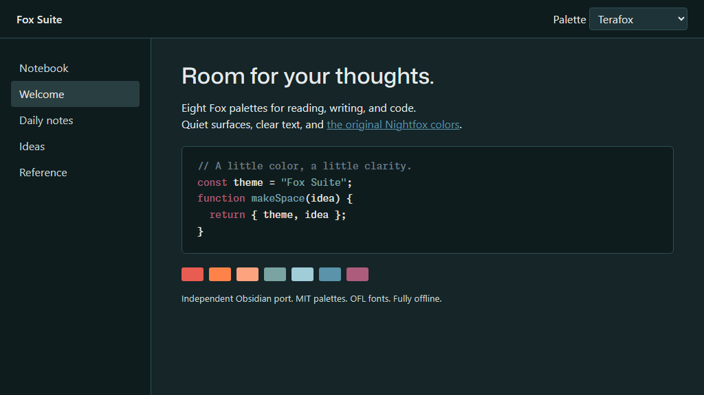
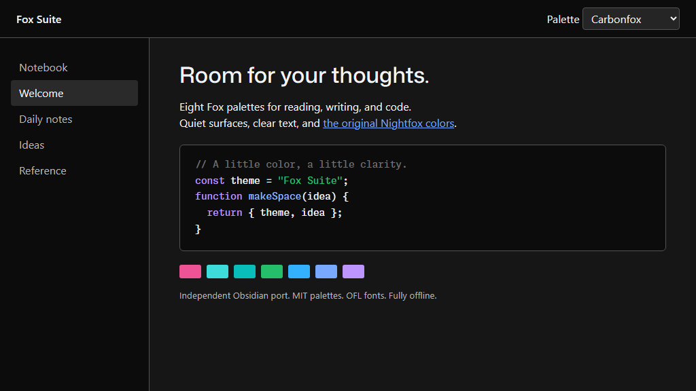

# Fox Suite

Seven [Nightfox](https://github.com/EdenEast/nightfox.nvim) palettes plus
Pilotfox in one self-contained Obsidian theme, with Monaspace Neon code and
Mona Sans headings.



| Base color scheme | Default | Other palettes |
|---|---|---|
| Light | Dayfox | Dawnfox, Pilotfox |
| Dark | Nightfox | Duskfox, Nordfox, Terafox, Carbonfox |

## Palettes

### Light

| Dayfox (default) | Dawnfox |
|---|---|
|  |  |
| **Pilotfox** | |
|  | |

### Dark

| Nightfox (default) | Duskfox |
|---|---|
|  |  |
| **Nordfox** | **Terafox** |
|  |  |
| **Carbonfox** | |
|  | |

Without any plugins, Light uses Dayfox and Dark uses Nightfox. To select any
other palette, use the free **Style Settings** community plugin; see
[Choose a palette](#choose-a-palette).
The Nightfox palettes do not override your reading width or configured body
text size. Pilotfox also applies its captured font stacks, type sizes, and
line heights.
Fonts and their licenses are embedded; no network requests are needed.

## Install manually

1. Create `<vault>\.obsidian\themes\Fox Suite\`.
2. Copy `manifest.json` and `theme.css` into that folder.
3. Select **Fox Suite** in **Settings -> Appearance -> Themes**. Reload Obsidian
   if it has not discovered the new manifest.
4. Choose Light or Dark as your base color scheme.

If you previously used a standalone `copilot-fox` CSS snippet, disable it and
choose **Pilotfox** instead; otherwise its overrides will still win over
every light palette.

## Choose a palette

Fox Suite has no palette menu of its own. Palettes are chosen with the
[Style Settings](https://github.com/mgmeyers/obsidian-style-settings)
community plugin, which reads the options the theme declares:

1. Open **Settings -> Community plugins** and turn on community plugins if
   Obsidian asks.
2. Select **Browse**, search for **Style Settings**, then install and enable it.
3. Open **Settings -> Style Settings -> Fox Suite**.
4. Pick a **Light palette** (Dayfox, Dawnfox, or Pilotfox) and a **Dark
   palette** (Nightfox, Duskfox, Nordfox, Terafox, or Carbonfox).

The two choices are saved independently. Obsidian's base color scheme
(**Settings -> Appearance -> Base color scheme**) decides which one is shown,
so you can, for example, use Pilotfox by day and Nordfox at night. Changes
apply immediately. If you disable Style Settings, the theme returns to Dayfox
and Nightfox.

## Pilotfox versus upstream Dayfox

**Dayfox** is the MIT-licensed upstream palette. **Pilotfox** layers the
236 values measured from the GitHub Copilot App 1.1.25 Dayfox appearance
(`palettes/pilotfox.json`) over it; any role not in that capture keeps
its upstream Dayfox value. Both share the background (`#F6F2EE`), foreground
(`#3D2B5A`), and blue (`#2848A9`), but secondary roles differ:

| Role in this port | Dayfox | Pilotfox |
|---|---|---|
| Secondary surface (`bg0`) | `#E4DCD4` | `#F1E9E7` |
| Muted text (`fg2`) | `#643F61` | `#685887` |
| Code comments | `#837A72` | `#867795` |
| Selection background (`sel0`) | `#E7D2BE` | `#3D2B5A` |
| Code strings | `#396847` | `#287980` |

These are role mappings, not a claim that a Neovim status line and an Obsidian
sidebar are identical components. Pilotfox also restyles primary buttons
and code-block sizing to match the capture. No claim is made that the other
variants reproduce Copilot's generated UI. See
[third-party notices](THIRD_PARTY_NOTICES.md).

## Build and check

Node.js 20 or later is sufficient. There are **no npm dependencies** and no
installation step.

```text
npm run build
npm run check
npm run package
```

`theme.css` is generated from the pinned upstream Lua palette files (read as
data, never executed), the Pilotfox values in
`palettes/pilotfox.json`, `scripts/shared.css`, and the checksummed fonts.
Edit those sources rather than the generated CSS. `npm run package` writes
a manual-install folder at `dist\Fox Suite\` using an explicit file
allowlist.

Open `preview.html` in a browser for a palette preview. Its sample content is
synthetic; the images are palette previews, not Obsidian screenshots. Append
a palette name to open it directly, for example `preview.html#nordfox`. Capture each palette at 1024×576 into
`screenshots\<name>.png` to refresh the gallery above.

## Publish manually

1. Review the author, stable theme name, README, and licenses.
2. Commit and publish this repository yourself. Nothing here auto-publishes.
3. Run `npm run check` and `npm run package`.
4. For an Obsidian directory submission, create a GitHub release whose tag
   exactly matches `manifest.json`'s version (initially `0.1.0`).
5. Attach `theme.css` and `manifest.json` to that release.
6. Submit through [Obsidian's Community directory](https://community.obsidian.md).

The minimum version is conservatively set to the version used for development.
Lower it only after checking the older version. Desktop palette rendering is
covered; mobile still needs a hands-on check before claiming mobile parity.
Before directory submission, replace the palette-preview image with a clean
actual Obsidian screenshot if requested by the reviewers.

## Credits and licenses

- Palettes: James Simpson / EdenEast, **MIT**, pinned in `palettes/upstream.json`.
- Original Obsidian mappings and build tooling: Bo Jordan, **MIT**.
- Monaspace Neon and Mona Sans fonts: **SIL OFL 1.1**, not MIT.

Full notices are in [THIRD_PARTY_NOTICES.md](THIRD_PARTY_NOTICES.md),
`licenses/`, and the generated stylesheet. This is an independent port with
no GitHub, Obsidian, or upstream-author endorsement.
